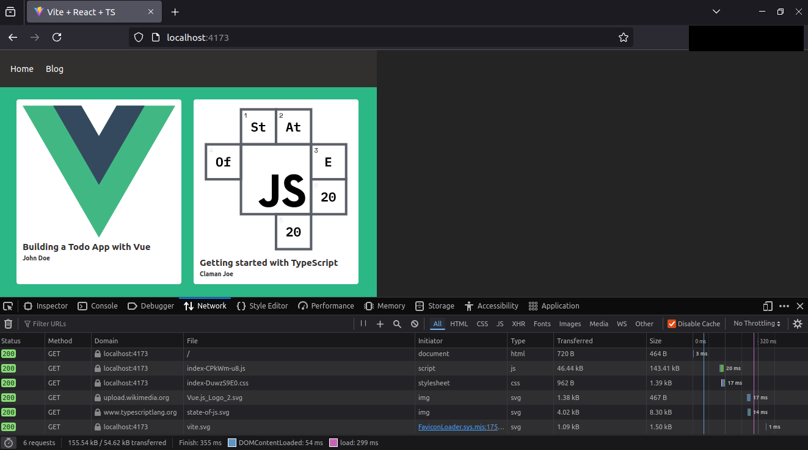

# FRONTEND | Practice - React, Vite and Typescript Performance Analysis

The aim of this project is to compare the performance of two web applications developed using different technology stacks for building a simple blog page.

This repository contains two projects implementing the same simple blog page. The objective is to compare performance between a project using Vite, TypeScript, and React against one using only React.


# Project Descriptions


## 1. react-app | React
A blog project implemented with React only.


## 2. vite-test-app | React + TypeScript App with Vite
A blog project implemented with React, TypeScript, and Vite.


# Note:

Remember to install the addtional libraries:

```bash
npm install
```

# Load time comparison results (Production)

## 1. react-app (REACT)

```bash
http://localhost:3000/
7 requests
163.63 Kb / 64.27 kB transferred
Finish: 434 ms
DOMContentLoaded: 68 ms
load: 459 ms
```


## 2. vite-test-app (REACT + VITE + TS)

```bash
http://localhost:4173/  
6 requests
155.54 kB / 54.62 kB transferred
Finish: 355 ms
DOMContentLoaded: 54 ms
load: 299 ms
```




# Conclusion

Using Vite improved the load time significantly, reducing it from 459 ms to 299 ms, making it 160 ms faster. Additionally, Vite optimized resource requests and reduced the transferred size by approximately 10 kB, demonstrating its superior efficiency for production builds.


# Note

When comparing both projects in the development environment, the performance results were unexpectedly poor for both setups. Despite the advantages of Vite in production, its development mode showed similar or slightly worse performance compared to the React app using Create React App. The details are as follows:


## Development environment comparison

### 1. react-app

```bash
http://localhost:3000/
7 requests
1.75 MB / 378.86 kB transferred
Finish: 655 ms
DOMContentLoaded: 49 ms
load: 604 ms
```


## 2. vite-test-app

```bash
http://localhost:5173/ 
18 requests
1.24 MB / 1.24 MB transferred
Finish: 658 ms
DOMContentLoaded: 48 ms
load: 616 ms
```


# Conclusion

In the development environment, both React (Create React App) and Vite delivered similar load times, with React finishing in 604 ms and Vite in 616 ms. However, Vite made significantly more requests (18 vs. 7), which may introduce additional overhead during development. While Vite did not demonstrate a clear advantage in load time or resource optimization in this environment, its focus on features like Hot Module Replacement (HMR) provides a better developer experience for iterative workflows.
